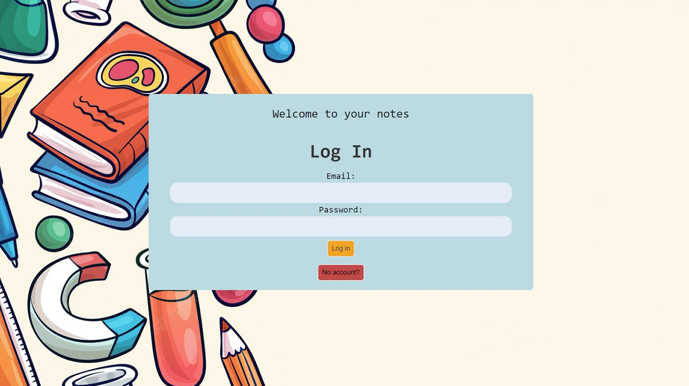
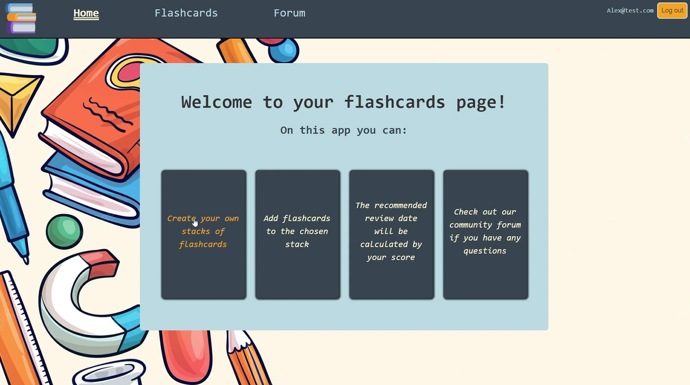
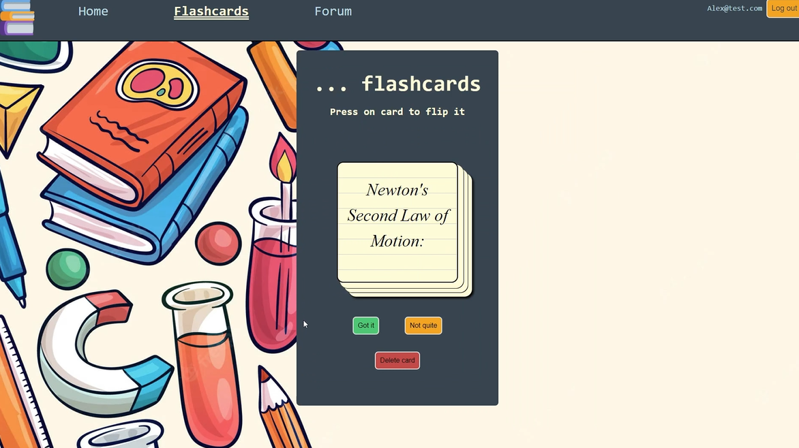
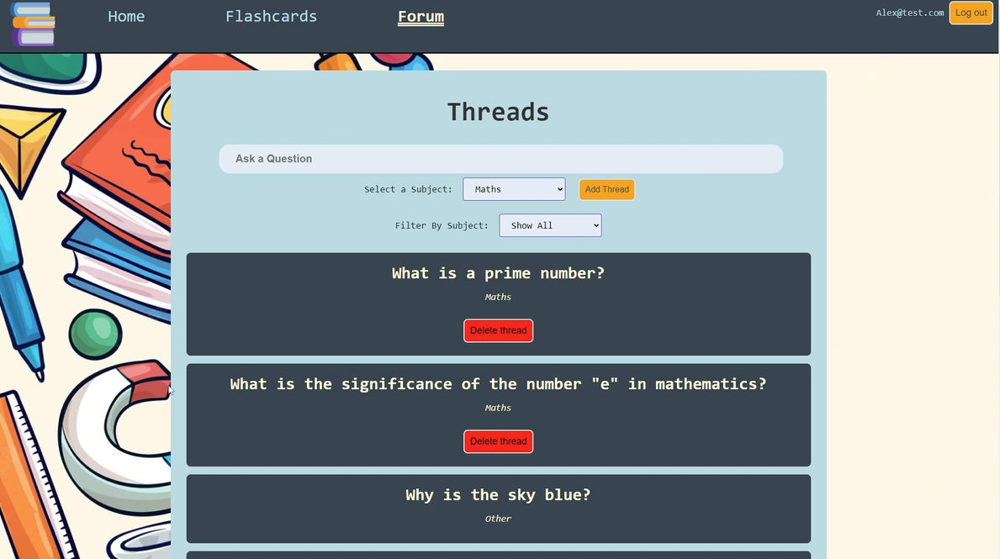

# Reddy_3_2_Front_End-
This website allows the user to create and revise their flashcards. It also has a forum where users can other users ask questions.

# Installation & usage
## Instalation

1. Clone the repository and connect to the API folder
```sh
git https://github.com/asiek728/Reddy_3_2_Front_End-

```  

2. Now run the following in the console:
```sh
npm install
npm run dev #this will start the application and make it live
```
3. The client will now be running on the port listed in the console - It should be 5173.  


# Technologies used
- HTML
- Javascript
- CSS
- React
- Mongoose
- Express
- Node.js

# Process
- Brainstorming and posting all our ideas to figma board
- Creating multiple wireframes for each of the website, and choosing the best ones
- Creating a trello board with all the tasks to complete
- Completing tasks from the board one at a time
- Testing the front end and back end everyday

# Screenshots/Images






# Wins & Challenges
## Wins
- Learning how to use React and Mongoose
- Learning how to Test and add User Authentication

## Chalenges
- Getting the flashcard only belonging to a specific user
- Back end testing with authorization involved

# Future features
- Sharing flashcards with other users
- Adding difficulty levels to each flashcard
- Adding timer to each flashcard
